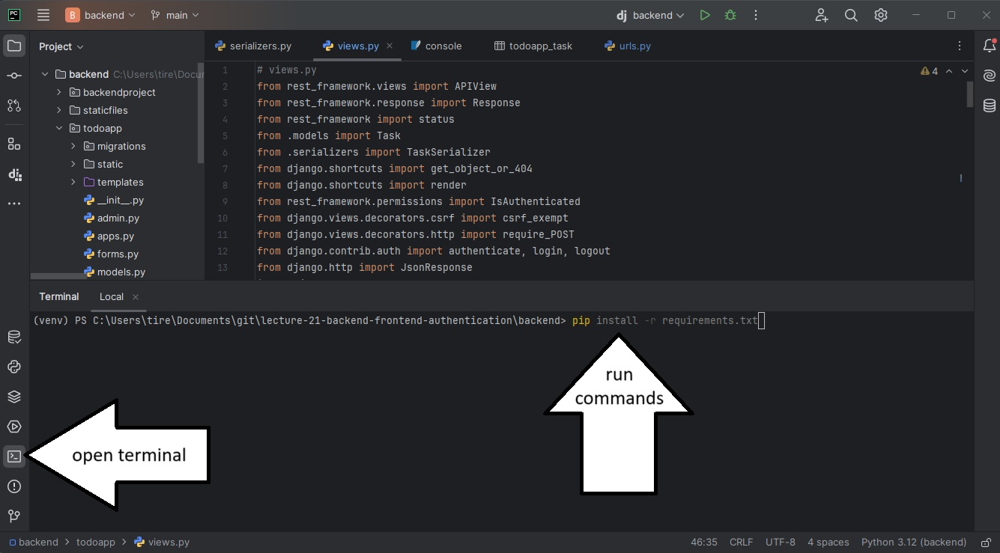

# project-template

*Do not submit this as your project README. I expect you to provide instructions for me, the instructor, to set up and run your application. To help you, this README currently provides some instructions to you, and I expect you to change it before you submit your backend deliverable.*

This is the repository that you should use for your term project. It does not have yet have any apps.

## Prerequisites (for your personal computers)

* Ensure Python is installed: https://www.python.org/downloads/
* Ensure Pycharm is installed: https://www.jetbrains.com/pycharm/download/?section=windows
* Ensure Git is installed: https://git-scm.com/downloads

If you needed to install Python or Git, you'll need to restart your computer before continuing.

## Steps to get this django application running on your own PC

Note that the lab computers may have vim as a default editor for commits. Vim can be scary. I recommend using nano. 

**TL;DR: run this command before doing anything else:** `git config --global core.editor "nano"` 

1) Open a terminal and navigate to the folder you want to create your project in (e.g. `cd ~Documents/Code`)
2) Clone this repository with `git clone <link to this repository>`
*If you are experiencing trouble with git, try restarting your computer. If that doesn't work, switch to a lab computer for now and post in the forums with a screenshot of the error after the lab*
3) Open the repository with PyCharm. You can do this by going file->open and selecting the cloned folder called `BIT2008-project-template`
4) Open a terminal using PyCharm and install dependencies using `pip install -r requirements.txt`

5) Create a file called `.env` in the top level directory (should be in the same folder as manage.py)
6) Generate a secret key by running `python -c 'from django.core.management.utils import get_random_secret_key; print(get_random_secret_key())'` in the terminal. Copy the output.
7) Edit `.env` (created in part 5) and add a line that says `SECRET_KEY="your-secret-key-here"`. Paste the output from part 6 into 'your-secret-key-here'.
8) On the terminal, run `python manage.py migrate`
9) Run the server by clicking the play button or running `python manage.py runserver` on the terminal
10) Navigate to 127.0.0.1:8000! You should get a success message in your web browser.

## Mandatory Configuration Steps

1. Create a new **Django App** by running `python manage.py startapp <app_name>`. The app name should be relevant to the purpose of your project: e.g. `workouttracker` for a workout tracker.
2. Commit and push your changes. After doing this, verify that your changes have been made on GitHub. You can commit and push by running the following commands: 
    * `git add .` (stage all modified files for commit)
    * `git commit -m "add django app"` (take snapshot of changes with message "add django app")
    * `git push origin main` (push new snapshots to GitHub)
3. Add the app to your list of INSTALLED_APPS in your `settings.py`
4. Create a `urls.py` in your app, and configure the `urls.py` in your project to include your app's `urls.py`
5. Create a simple "hello world" view - if someone makes a request to `127.0.0.1:8000/`, they should get an HTTP Response that says "Hello World!"
6. Commit and push your changes again
